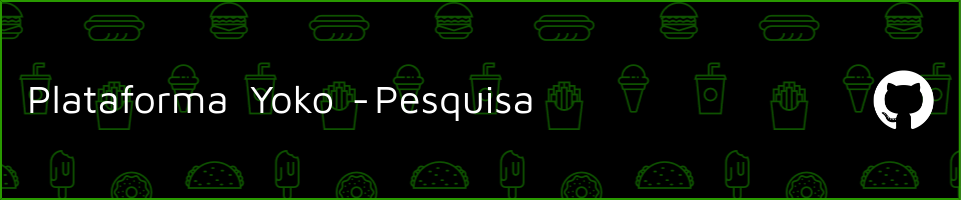

# 🎓 Módulo de Pesquisa

Sistema web desenvolvido para auxiliar no gerenciamento e acompanhamento de projetos de pesquisa de instituição de ensino superior.

---

## Quem utiliza?

- **Universidade Federal do Cariri (UFCA)**

---

## Status do Sistema

- **UFCA**

---

## Dashboard de LOGS

- **UFCA**

Os logs da aplicação são monitorados via **AWS CloudWatch**.

## 📌 Funcionalidades

- 📁 Cadastro e gerenciamento de projetos de pesquisa
- 🧮 Cálculo automático da pontuação Lattes
- 🧑‍⚖️ Avaliação Ad Hoc por avaliadores externos
- 🧾 Consulta e visualização de resultados dos projetos
- 👨‍🎓 Indicação e acompanhamento de discentes vinculados
- 📤 Envio de folhas de frequência mensal
- 🧾 Baixa automaticamento o Lattes a partir do IDLattes

---

## 🛠️ Tecnologias Utilizadas

- **Linguagem:** Python 3.13.7 (container)
- **Framework Web:** Flask  3.1.1
- **Banco de Dados:** (MariaDB 11.5)
- **Docker:** Utilizado para containerização do sistema

---

## 🔐 Recursos de Segurança

Este projeto Flask foi desenvolvido com atenção às melhores práticas de segurança. Abaixo estão os principais recursos implementados:

- **Autenticação Segura**
  - Sistema de login com autenticação baseada em senhas fortes, geradas automaticamente sem intervenção do usuário.
  - Proteção contra força bruta com **Flask-Limiter** para limitar tentativas de login.
  - Captcha reCAPTCHA v2 para proteger formulários de login e registro contra bots.

- **Autorização baseada em papéis (RBAC)**
  - Gerenciamento de permissões por nível de acesso (usuário, admin).
  - Rotas protegidas com decoradores de verificação de acesso.

- **Proteção contra CSRF**
  - Tokens CSRF automáticos com **Flask-WTF**, incluídos em todos os formulários.
  - Validação ativa para impedir requisições forjadas.

- **Validação e Sanitização de Entradas**
  - Validação de entradas do usuário.
  - Prevenção contra injeções de código malicioso (SQL Injection, XSS).

- **Criptografia**
  - Armazenamento seguro de senhas utilizando **Argon2** com pepper (HMAC)
  - Criptografia de arquivos com **AES-256 e GPG**
  - Criptografia do Banco de Dados com **AES-256-CBC** para proteger dados em repouso

- **Comunicação Segura**
  - Obrigatoriedade de uso de HTTPS/TLS em produção.
  - Configuração de cabeçalhos de segurança (HSTS, X-Frame-Options, etc.) com **Flask-Talisman**.

- **Auditoria e Monitoramento**
  - Registro de logs de acesso e erros com **Loguru** estruturado, **AWS CloudWatch** e **Sentry** .
  - Monitoramento de erros, desempenho e disponibilidade com **BetterStack** e **Sentry**.
  